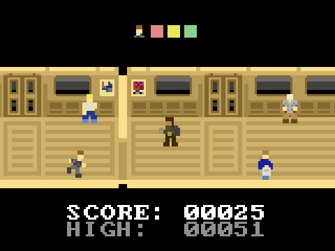

Panicky Communter
=================

Story
-----

Your commuter train has stopped in the tunnel, because trains do that. You need to run from the back of the train to the front of it to calm your anxiety about being late to work.

Look out for other commuters who are standing in your way!

### Fat Guys ###

They just stand there. You have to run around them.

### Hobos ###

They want your spare change. When you try to run around them, they might get in your way again.

### Christians ###

They want your soul, and are also running to the front of the train. When they approach from behind, you'll have to get out of their way.

Controls
--------

### Menu Screen ###

* *Up* and *Down*: Change menu selection.
* *Enter*: Make selection to start game or view credits.
* *Escape*: Quit and play a better game.

### Game Screen ###

* *Up*: Move to one side of the train car.
* *Down*: Move to the other side of the train car.
* *Enter*: Pause the game to update your facebook status.
* *Escape*: Return to the menu screen.

